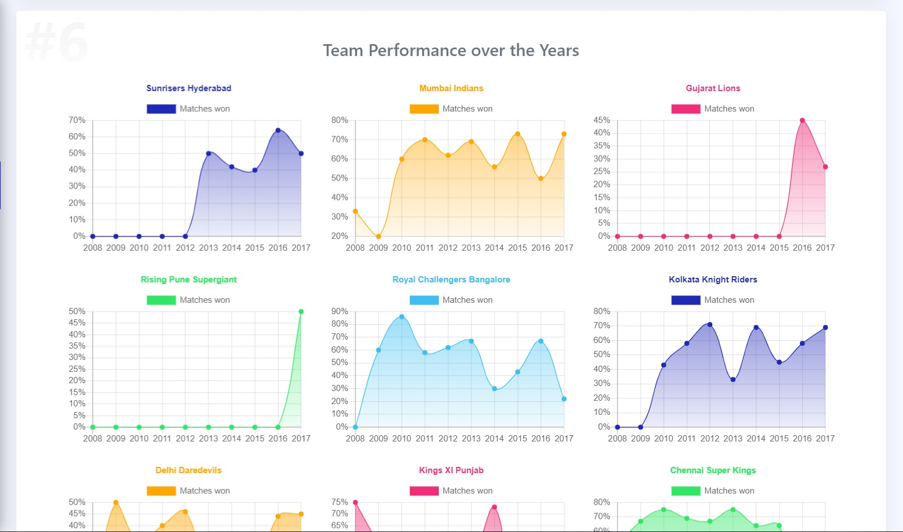
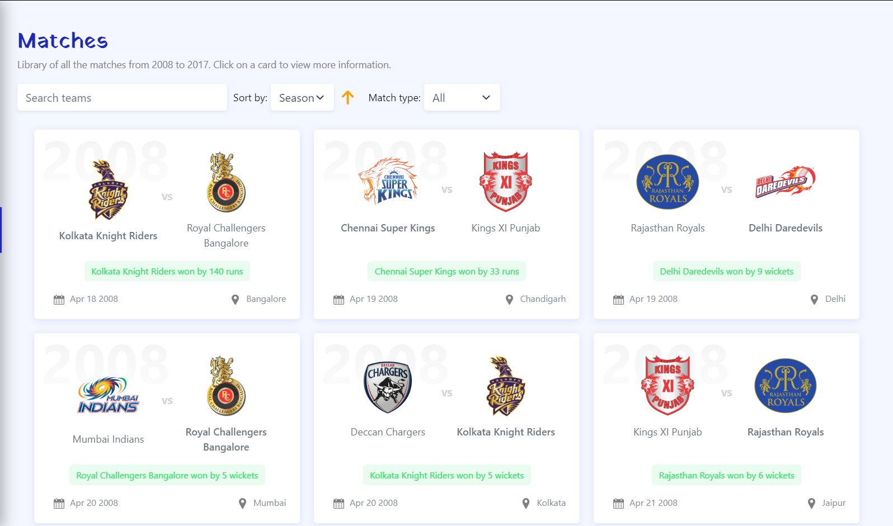

# IPL Dashboard


## Live Demo

[Click here to open the live demo](https://dhruvmisra.github.io/IPL-Dashboard-Atlan/)
and explore the 10 years of IPL!

## Description

This dashboard summarizes 10 years of IPL (2008 - 2017) showcasing all the match history and trivia statistics. It offers many SPA functionalities like routing, basic state management, PWA and offline availability. All the data is being parsed from a CSV file and I've tried to make the system as dynamic as possible, allowing modifications to the CSV without affecting the core functionalities and chart generation.

## Key features

* **Home** view showing random trivia statistic and a match which was played on the same *date* as today.


* **Trivia** view with all the trivia stats listed for easy reference.


* **Matches** view contains a library for each and every match played between 2008 and 2017. It also allows multiple filtering and sorting of matches.


* Query-based route URLs (using match `id`) for each match for easy sharing.


* Fully dynamic chart creation using a custom-made component.

* Setup a seamless SCSS styling workflow for theming, making it as simple as updating one variable to change the look of the entire app.

* Completely responsive.

>### How about some trivia about the computation of trivia?
> All the trivia stats are being computed in a [separate file](src/components/Trivia/trivia.js) using just a single loop! They are stored as an array of objects with each object representing an input for the `Chart` component.
>
> This gives a good abstraction for the trivia computation with only 1 exported method.

## Libraries used

* Vue.js
* Vue Router
* Chart.js
* Bootstrap (for quick layout designing and theming)
* AOS (for some simple timed animations)

## Dataset

Indian Premier League (Match Analysis) by *Saurav Anand* (https://www.kaggle.com/saurav9786/indian-premier-league-match-analysis)

## Bonus Points

✅ Built on Vue.js (with ❤)

✅ Optimized loading time 
* All static assets used (team logos, banner, etc) have been optimized for web.
* All icons are SVG based. 
* Minimal imports of external resources.
* Optimized time complexity by computing the trivia stats only once and using them throughout the app.

✅ Mobile responsive (mostly follows Fluid Design)

✅ Progressive Web App support (using Vue CLI PWA plugin)

✅ Usable offline (uses service-worker to cache the data)

## Design inspiration

* This beautiful dashboard by *Umar Aji Pratama*: https://dribbble.com/shots/5507197-Dashboard-Team-Coordination 
* Ton of Google searches for other components

## Project setup
```
npm install
npm run serve
```